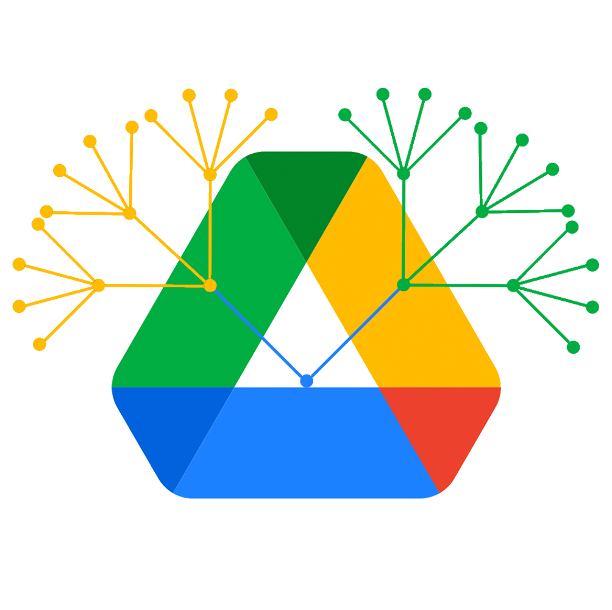
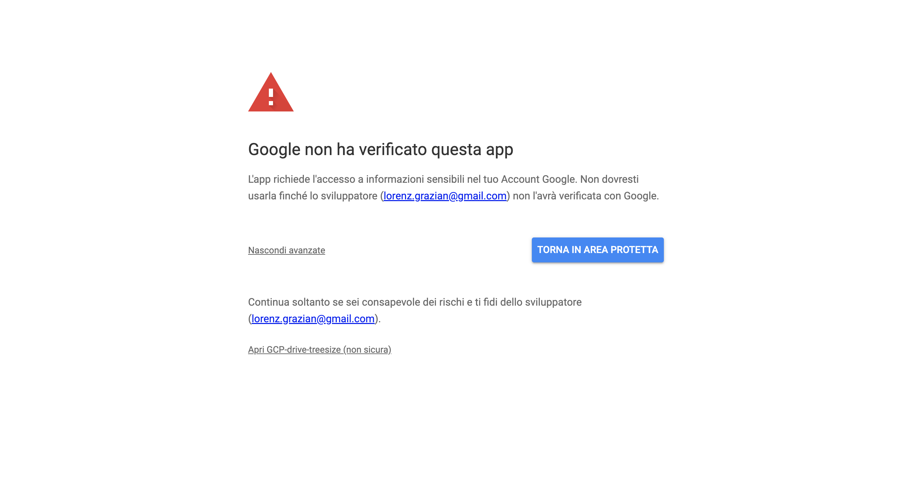
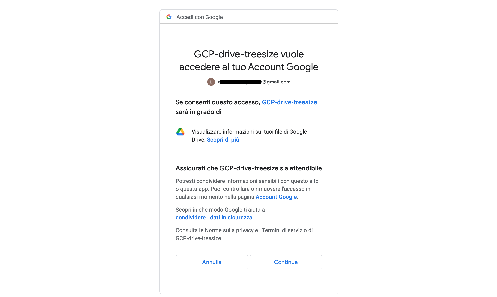

# Drive Tree
Drive tree is a desktop application that allows you to browse your Google Drive files and view the size of each directory.
<p align="center">
  
</p>

# Features
 - One command: sign in, scan and browse, all from your browser.
 - Sign-in is automatic: approve access on the Google page and you're redirected back to the app, no codes to copy.
 - No files are written to disk: your token and file data live in memory only and are gone when you close the app.
 - Browse folders sorted by size, with the share of each item in its folder, a name filter and sortable columns.
 - Statistics: space by file type and your largest files.
 - Shows your Google storage quota, and lets you rescan or sign out at any time.

# How to use
```
go run drive-tree.go
```

Binaries available [here](https://github.com/looCiprian/GCP-drive-treesize/releases).

Your browser opens on the Google sign-in page. Google may warn you that the app isn't verified yet: choose *Advanced*, then continue.

<p align="center">
  
</p>

Press the confirm button to grant read-only access to your files metadata.

<p align="center">
  
</p>

You're sent back to the app, which scans your Drive and shows the results when done.

Flags:
 - `-no-browser`: don't open the browser, just print the link.
 - `-addr`: address to listen on (default `127.0.0.1:8080`). The port must stay `8080`, it's the one registered for the Google sign-in redirect.

## Docker
```
docker build -t my-drive-tree-app .
docker run -it --rm -p 8080:8080 --name my-running-app my-drive-tree-app
```

Docker can't open the browser for you: open the link printed on the screen.
