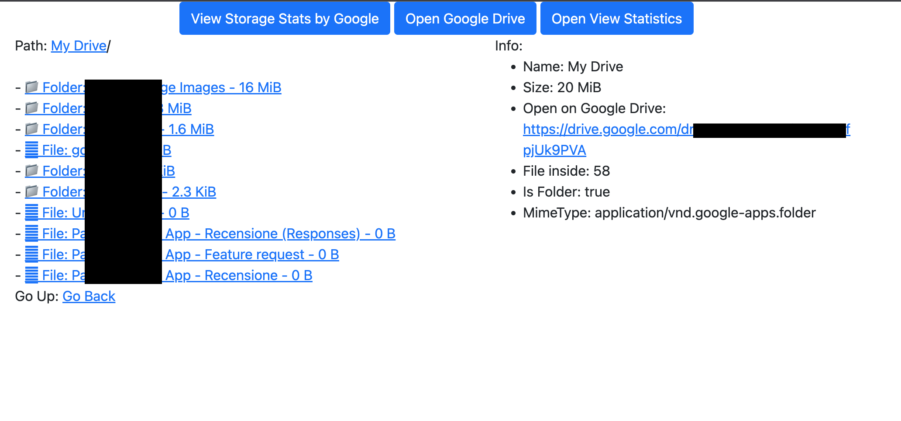

# Drive Tree
Drive tree is a desktop application that allows you to browse your Google Drive files and view the size of each directory.
<p align="center">
  
</p>

# Features
The tool is composed of two main parts:
 - scraper: it purpose is to get your files metadata from Google Drive.
 - web: it purpose is to show the files tree in a web browser.

# How to use

### Scraper
```
go run drive-tree.go scraper
```

### Web
```
go run drive-tree.go web
```

## Docker
```
docker build -t my-drive-tree-app .
docker run -it --rm -v $(pwd):/drive-tree -p 8080:8080 --name my-running-app my-drive-tree-app

$ drive-tree scraper
$ drive-tree web
```

Note: note that Docker is not able to open the browser for you. Follow the instructions on the screen to open the browser.

# Demo
Run:

```
go run drive-tree.go scraper
```

Your browser will be opened with the following warning (accept the warning since the application is not approved by Google yet):

<p align="center">
  
</p>

Press the confirm button on the right to grant permission to the application

<p align="center">
  
</p>

Once authenticated copy the authentication code

<p align="center">
  
</p>

Paste the authentication code in the terminal

<p align="center">
  
</p>

The application will now be running.

Once finished, run:

```
go run drive-tree.go web
```

To view the results in the browser.

<p align="center">
  
</p>
